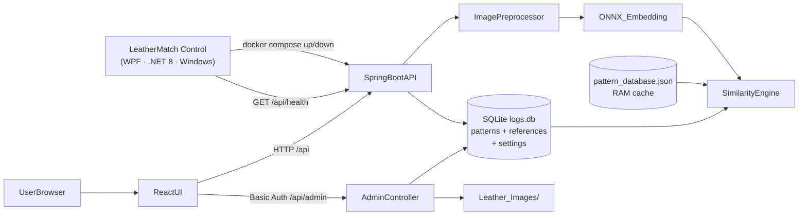
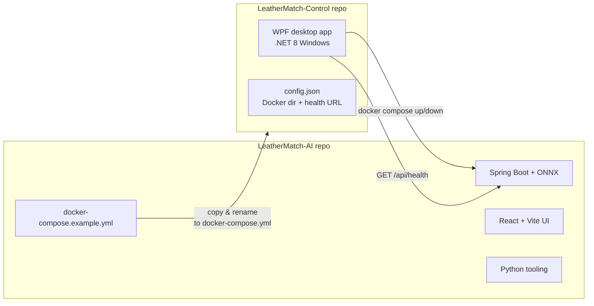

# LeatherMatch-AI

Offline-first leather pattern recognition for factory use (LAN-hosted web app). The system does **not** do classification. Instead, it extracts an **embedding** from an uploaded image and finds the closest reference pattern using **cosine similarity**.

---

## LeatherMatch Ecosystem

The LeatherMatch system consists of two separate repositories:

| Repository | Stack | Role |
|---|---|---|
| **LeatherMatch-AI** *(this repo)* | Java · Python · React · Docker | AI inference server + web UI |
| **LeatherMatch-Control** | C# · WPF · .NET 8 · Windows | Desktop control panel for managing the AI service |

LeatherMatch-Control lets operators start, stop, and monitor the AI service without any technical knowledge — see the [LeatherMatch Control](#leathermatch-control-windows) section below.

---

## Prerequisites (host machine)

- **Java**: JDK 17
- **Backend build/run**: Maven
- **Python tooling**: Python 3.10+ (only if you use `build_database.py`)
- **Frontend dev**: Node.js 18+

## What this repo contains (today)

- **Java backend (runtime)**: Spring Boot + ONNX Runtime for embedding extraction, REST API, SQLite persistence, admin panel endpoints.
- **Python tooling (offline utilities)**: build the embedding database and validate similarity logic.
- **Frontend**: React (TypeScript) + Vite — admin panel + match page (under `Frontend/`).

## High-level architecture



## Git repositories



---

## Key idea (matching)

- Reference embeddings are generated ahead of time (Python tooling) and stored in `data/pattern_database.json`.
  New references can also be added at runtime via the admin panel — no restart needed.
- At runtime, the backend:
  - preprocesses the uploaded image (224×224, normalized),
  - runs ONNX inference to get an embedding vector (dimension depends on the model),
  - **L2-normalizes only the query embedding**,
  - computes cosine similarity (dot product for normalized vectors),
  - picks the best match using **max similarity per pattern**,
  - applies a threshold (default: `0.70`, adjustable at runtime) to decide MATCH vs UNCERTAIN.

## Quick Checklist — Operator + Developer
- Purpose: offline-first leather pattern matching via embedding + cosine similarity (no classification).
- Roles: `operator` uses `/match` + submit feedback; `admin` manages `/admin/**` (patterns, feedback, logs, settings).
- Quick start:
  - Dev: run backend (Spring Boot) + frontend (Vite).
  - LAN/Prod: run `docker compose up -d` and access `http://HOST_IP:8080`.
- Security: HTTP Basic Auth is enabled; use strong credentials configured in `docker-compose.yml` (fail-fast password rules).
- Matching decision summary: `threshold` and `margin` are used to separate `MATCH` vs `UNCERTAIN`.
- Critical admin flows: manage patterns, upload/import reference images + choose thumbnail, review feedback queue, adjust similarity settings at runtime.
- Control point: verify the service with `GET /api/health`.

## Repository layout

```
LeatherMatch-AI/
├─ Backend/                         # Java Spring Boot backend (runtime)
│  └─ src/main/java/com/example/src/
│     ├─ config/                    # SecurityConfig (HTTP Basic Auth)
│     ├─ controller/                # PatternMatchController + AdminController + SpaController (SPA forward)
│     ├─ dto/                       # MatchResult, ErrorResponse, PatternDto, ReferenceImageDto, SettingsDto
│     ├─ exception/                 # GlobalExceptionHandler
│     ├─ preprocessing/             # Image preprocessing (224x224, NCHW)
│     └─ service/                   # ONNX loader, EmbeddingService, DatabaseService,
│                                   # SimilarityService, LogService,
│                                   # AdminDatabaseService, SettingsService
├─ Frontend/                        # React + Vite admin UI
│  └─ src/
│     ├─ api/client.ts              # Axios instance with Basic Auth interceptor
│     ├─ components/                # Layout (sidebar), ProtectedRoute
│     └─ pages/
│        ├─ LoginPage.tsx
│        ├─ MatchPage.tsx           # Upload image → show match result
│        └─ admin/
│           ├─ PatternsPage.tsx     # List + add + delete patterns
│           ├─ PatternDetailPage.tsx# Upload / import / preview reference images
│           ├─ LogsPage.tsx         # Paginated match logs with filters
│           └─ SettingsPage.tsx     # Threshold slider
├─ model/
│  └─ leather_model.onnx            # ONNX feature extractor (not in repo — provide separately)
├─ Leather_Images/                  # Reference images by pattern code (not in repo)
├─ data/
│  ├─ pattern_database.json         # Legacy embedding database (built by Python tooling)
│  └─ logs.db                       # SQLite — match_logs, patterns, reference_images, settings
├─ build_database.py                # Build embeddings JSON database (Python tooling)
├─ verify_setup.py                  # Verify local environment + paths
├─ test_similarity.py               # Python reference matcher (ground truth)
├─ requirements.txt                 # Python deps for tooling
├─ Dockerfile                       # Multi-stage build (Node → Maven → JRE runtime)
├─ docker-compose.example.yml       # Template for server deployment
└─ .gitignore
```

---

## Run on a LAN (host machine)

Goal: only the **host machine** runs the server; other users only need a browser.

### 1) Build / update the embedding database (host, optional)

Only needed if you add new patterns via Python tooling instead of the admin panel.

```bash
pip install -r requirements.txt
python verify_setup.py
python build_database.py
```

This generates/updates `data/pattern_database.json`.
Patterns added here will be available for **matching** (in-memory cache and `GET /api/patterns`) on next server start.

Note: the **admin panel pattern list** (`GET /api/admin/patterns`) comes from SQLite `patterns`. If you want to manage a JSON-only pattern in the admin UI, create the same pattern code in the admin panel first, then use **Import from disk** to register its images into SQLite.

### 2) Start the backend (host)

Open the `Backend/` project in Eclipse and run `LeatherMatchAiApplication` as a Spring Boot app.
Or from a terminal:

```powershell
mvn -f Backend/pom.xml spring-boot:run
```

The server binds to `0.0.0.0:8080` — accessible from any device on the LAN.

### 3) Start the frontend (dev mode)

Requires [Node.js](https://nodejs.org) v18+.

```powershell
cd Frontend
npm install      # first time only
npm run dev
# → http://localhost:5173
```

Vite proxies all `/api` requests to `http://localhost:8080` automatically.

LAN note: if you want other devices to open the dev server, start it with:

```powershell
cd Frontend
npm run dev -- --host
```

### 4) Access from other devices

From another device on the same network, open:

- `http://HOST_IP:8080` (if serving the built frontend from Spring Boot — see below)
- `http://HOST_IP:5173` (if the Vite dev server is running and reachable)

> **Windows Firewall**: allow inbound TCP on port 8080 (and 5173 for dev).

### 5) Build frontend for production (serve from Spring Boot)

```powershell
cd Frontend
npm run build
# Copy Frontend/dist/* → Backend/src/main/resources/static/
```

After rebuilding and restarting Spring Boot, the UI is served at `http://HOST_IP:8080`.

> **Note:** Files in `Frontend/public/` (e.g. `login-bg.png`) are copied by Vite into `dist/` and then into `static/` during the Docker build. They are served without authentication. All SPA routes (`/login`, `/match`, `/admin/**`) are forwarded to `index.html` by `SpaController` — no Basic-Auth popup on page refresh.

---

## Docker setup (LAN)

With this method you can run the application even on a server PC without Java, Maven, or Node.js installed. The only requirement is **Docker Desktop**.

### Prerequisites

- **Host:** Windows 10 / 11
- **Docker Desktop** must be installed and running

### Build (on development machine)

In the repo root (where the Dockerfile is located):

```powershell
docker build -t leathermatch-ai:latest .
```

This runs a three-stage build:
1. Compiles the React/Vite frontend with Node 18.
2. Compiles the Spring Boot backend with Maven + JDK 17; embeds the frontend output into the JAR.
3. Produces a minimal runtime image containing only JRE 17 (the ONNX model is also copied into the image).

### Server setup

1. Create a working directory on the server PC:

   ```
   C:\LeatherMatch\
   ├── docker-compose.yml   ← described below
   └── data\                ← empty folder; SQLite and feedback images are written here
   ```

2. Copy `docker-compose.example.yml` to this folder and rename it to `docker-compose.yml`.

3. **SECURITY: Configure credentials and CORS** in `docker-compose.yml`:

   **CRITICAL:** The application will NOT start with weak or missing passwords (fail-fast security).
   
   Edit the `environment` section:
   
   ```yaml
   environment:
     - SPRING_PROFILES_ACTIVE=docker
     
     # Replace with strong passwords (minimum 12 characters)
     - ADMIN_PASSWORD=YourVeryStrongPassword123!@#
     - OPERATOR_PASSWORD=AnotherStrongPassword456$%^
     
     # Replace SERVER_IP with your actual LAN IP (e.g., 192.168.1.100)
     - CORS_ALLOWED_ORIGINS=http://192.168.1.100:8080
     
     # Set to true only if using HTTPS
     - SSL_ENABLED=false
   ```
   
   **Password Requirements:**
   - Minimum 12 characters
   - Cannot be weak passwords like: `changeme123`, `operator123`, `password123`, etc.
   - Application will abort startup if passwords are weak
   
   **CORS Configuration:**
   - Replace `SERVER_IP` with the actual IP address of the server on your LAN
   - For multiple frontend origins, use comma-separated list: `http://IP1:PORT1,http://IP2:PORT2`

4. Edit the `Leather_Images` volume line in `docker-compose.yml` to point to the actual location on your server:

   ```yaml
   # External drive example:
   - D:/LeatherMatchData/Leather_Images:/app/Leather_Images
   # Local drive example:
   - C:/LeatherMatchData/Leather_Images:/app/Leather_Images
   ```

5. Transfer the `leathermatch-ai:latest` image built on the development machine to the server:

   ```powershell
   # On development machine — save image to file:
   docker save leathermatch-ai:latest -o leathermatch-ai.tar

   # On server machine — load image:
   docker load -i leathermatch-ai.tar
   ```

### Running

On the server PC in the `C:\LeatherMatch\` folder:

```powershell
docker compose up -d
```

The application is accessible at `http://SERVER_IP:8080` from all devices on the LAN.

> **Windows Firewall:** Allow inbound TCP on port 8080 on the server PC.

### Stopping

```powershell
docker compose down
```

### Updating

1. Build a new image on the development machine:

   ```powershell
   docker build -t leathermatch-ai:latest .
   ```

2. Transfer the new image to the server (`docker save` / `docker load`).

3. Apply the update on the server:

   ```powershell
   docker compose up -d
   ```

   Docker Compose stops the old container and restarts it with the new image. The `data/` and `Leather_Images/` volumes remain untouched.

---

### Quick Docker test (local)

Use `docker-compose.local.yml` to test the image on your development machine. This file mounts the existing `data/` and `Leather_Images/` folders into the container.

```powershell
# In repo root:
docker build -t leathermatch-ai:latest .
docker compose -f docker-compose.local.yml up -d
```

Verification:

```powershell
# Health check:
curl http://localhost:8080/api/health

# Admin panel in browser:
# http://localhost:8080  →  login with your configured admin credentials
```

To stop:

```powershell
docker compose -f docker-compose.local.yml down
```

> The volume paths in `docker-compose.local.yml` (`E:/Proje/LeatherMatch-AI/...`) are set for the development machine. Edit them if you are working from a different drive.

---

## Admin panel

| URL | Description |
|-----|-------------|
| `http://HOST_IP:8080/login` | Sign in with credentials configured in `docker-compose.yml` (see Security Configuration) |
| `/match` | Upload a leather image → get best pattern match |
| `/admin/feedback` | Review Queue — operator corrections (approve/reject/add as reference) |
| `/admin/patterns` | List all patterns, add new, delete |
| `/admin/patterns/:id` | Upload / import reference images, preview thumbnails, choose thumbnail via "Thumbnail yap" |
| `/admin/logs` | Paginated match log with pattern and result filters |
| `/admin/settings` | Change similarity threshold at runtime (no restart needed) |

**Browser refresh / deep links:** All SPA routes (`/login`, `/match`, `/admin/**`) are handled by `SpaController` on the backend, which forwards them to `index.html`. This means pressing F5 or navigating directly to any of these URLs never triggers a browser Basic-Auth dialog or a 500 error — React Router takes over on the client side.

**Security Note:** Default credentials (`admin`/`changeme123`, `operator`/`changeme123`) are rejected at startup. You must configure strong passwords in `docker-compose.yml` (see deployment instructions above).

Credentials are set in `Backend/src/main/resources/application.properties` (not tracked by git — copy from `application.properties.example` and set your own values):

```properties
# Admin: full access to /api/admin/** and /api/match
admin.username=admin
admin.password=changeme123

# Operator: match-only (example user)
operator.username=operator
operator.password=changeme123
```

| User | Password | Access |
|------|----------|--------|
| `admin` | `changeme123` | Match + Admin |
| `operator` | `changeme123` | Match only |

Security note: change default passwords before using on a shared network.

**Operator UI:** Operators log in via `/login` and use `/match` (no admin nav). Admins see `/admin/*` after login. Operators who try `/admin/*` get 403.

### Importing existing reference images

Patterns that exist in SQLite (created via admin UI) can show their **true embedding count**
(including JSON-loaded cache embeddings) even before their images are imported into SQLite.

If the reference images already exist on disk under `Leather_Images/<PATTERN_CODE>/`,
import them so they are registered in SQLite and usable for thumbnails / management.

On the pattern detail page a banner appears — click **"Import from disk"** to scan
`Leather_Images/<PATTERN_CODE>/`, run ONNX inference on each image, and register them.
This is a one-time action per pattern; it is idempotent (already-registered files are skipped).

### Thumbnail selection

On the pattern detail page, the **"Thumbnail yap"** button opens a modal to choose which reference image is used as the pattern thumbnail. The selected image is **copied to `Leather_Images/<CODE>/_thumbnail.jpg`** (or `.png`), and the Match screen serves this file. Thumbnails and reference images use a zoomable modal (double-click to zoom, pinch on mobile).

---

## REST API summary

### Public (no auth)

| Method | Path | Description |
|--------|------|-------------|
| GET | `/api/patterns` | List all pattern codes in memory |
| GET | `/api/health` | Server health + loaded counts |
| GET | `/api/stats` | Pattern/embedding counts + accuracy stats |

### Authenticated (HTTP Basic Auth)

| Method | Path | Description |
|--------|------|-------------|
| POST | `/api/match` | Upload image → returns best pattern + score (operator or admin) |
| POST | `/api/feedback` | Submit correction when match is wrong (operator or admin) |
| GET | `/api/patterns/{code}/thumbnail` | Return thumbnail image for pattern (admin/operator auth; uses selected or first reference) |

### Admin (HTTP Basic Auth, admin role only)

| Method | Path | Description |
|--------|------|-------------|
| GET | `/api/admin/patterns` | List patterns with reference counts |
| POST | `/api/admin/patterns` | Create pattern `{"code": "XY-001"}` |
| DELETE | `/api/admin/patterns/{id}` | Delete pattern + all its references |
| GET | `/api/admin/patterns/{id}/references` | List registered references |
| POST | `/api/admin/patterns/{id}/references` | Upload image(s), generate embedding, persist |
| POST | `/api/admin/patterns/{id}/import-from-disk` | Scan disk and import unregistered images |
| PUT | `/api/admin/patterns/{id}/thumbnail-reference` | Set thumbnail reference `{"referenceId": 123}` |
| GET | `/api/admin/references/{id}/image` | Stream image file (used by thumbnail UI) |
| DELETE | `/api/admin/references/{id}` | Delete single reference |
| GET | `/api/admin/settings` | Get current threshold **and margin** |
| PUT | `/api/admin/settings/threshold` | Update threshold `{"threshold": 0.75}` |
| PUT | `/api/admin/settings/margin` | Update top-2 margin `{"margin": 0.03}` (gap between best and second-best scores) |
| GET | `/api/admin/feedback` | Paginated feedback list (`?status&limit&offset`) |
| POST | `/api/admin/feedback/{id}/approve` | Approve feedback |
| POST | `/api/admin/feedback/{id}/reject` | Reject feedback |
| POST | `/api/admin/feedback/{id}/approve-and-add-reference` | Approve and add image as reference |
| GET | `/api/admin/logs` | Paginated logs (`?limit&offset&pattern&isMatch`) |
| GET | `/api/admin/metrics` | Log-derived metrics (match/uncertain rates, latency, score histogram, per-pattern stats) |

---

## Storage locations

| What | Where |
|------|-------|
| ONNX model | `model/leather_model.onnx` |
| Legacy embedding DB | `data/pattern_database.json` (read-only at runtime) |
| SQLite database | `data/logs.db` (match_logs, match_feedback, patterns, reference_images, settings) |
| Feedback images | `data/feedback_images/` (operator corrections pending review) |
| Reference images | `Leather_Images/<PATTERN_CODE>/<filename>.jpg` |

### How to test mobile

- **Chrome DevTools**: Run `npm run dev`, open the app in Chrome, press `Ctrl+Shift+M` to toggle device toolbar. Select "iPhone SE" (375px) or "Responsive" and set width to 320px.
- **Real device**: Run `npm run dev -- --host`, find your host IP (e.g. `ipconfig`), open `http://HOST_IP:5173` on your phone.
- **Production**: After `npm run build` and copying `dist/*` to `Backend/src/main/resources/static/`, access `http://HOST_IP:8080` from a phone.

---

## LeatherMatch Control (Windows)

[LeatherMatch-Control](https://github.com/your-org/LeatherMatch-Control) is a separate Windows desktop application that provides a graphical control panel for managing the LeatherMatch-AI Docker service — no command line required.

**Tech stack:** C# 12 · WPF · .NET 8 (`net8.0-windows`) · pure BCL (no third-party packages)

**Key features:**

| Feature | Description |
|---|---|
| Server control | Start / stop the LeatherMatch-AI service via Docker Compose with a single click |
| Health monitoring | Color-coded status indicator (green / yellow / red / gray) via `GET /api/health` |
| Auto refresh | Configurable polling interval (default: 15 s) |
| Scheduled start/stop | Automatically start and stop the service at configured daily times |
| Settings UI | Configure Docker Compose directory, health check URL, and schedule |

**Requirements:** Windows 10 x64 · .NET 8 Runtime · Docker Desktop (Compose V2)

**Configuration (`config.json`):**

```json
{
  "ComposeWorkingDirectory": "C:\\LeatherMatch",
  "HealthCheckUrl": "http://localhost:8080/api/health",
  "AutoRefreshIntervalSeconds": 15,
  "AutoStartEnabled": false,
  "AutoStopEnabled": false,
  "StartTime": "09:00",
  "StopTime": "18:00"
}
```

The `ComposeWorkingDirectory` must point to the folder containing your `docker-compose.yml` (copied from `docker-compose.example.yml` in this repo).

See the [LeatherMatch-Control repository](https://github.com/your-org/LeatherMatch-Control) for full build and setup instructions.

---

## License

Copyright (c) 2026

This source code is made available for **portfolio and demonstration purposes only**.
Commercial use, redistribution, and production deployment are prohibited without prior written permission.
See [LICENSE](LICENSE) for full terms.
